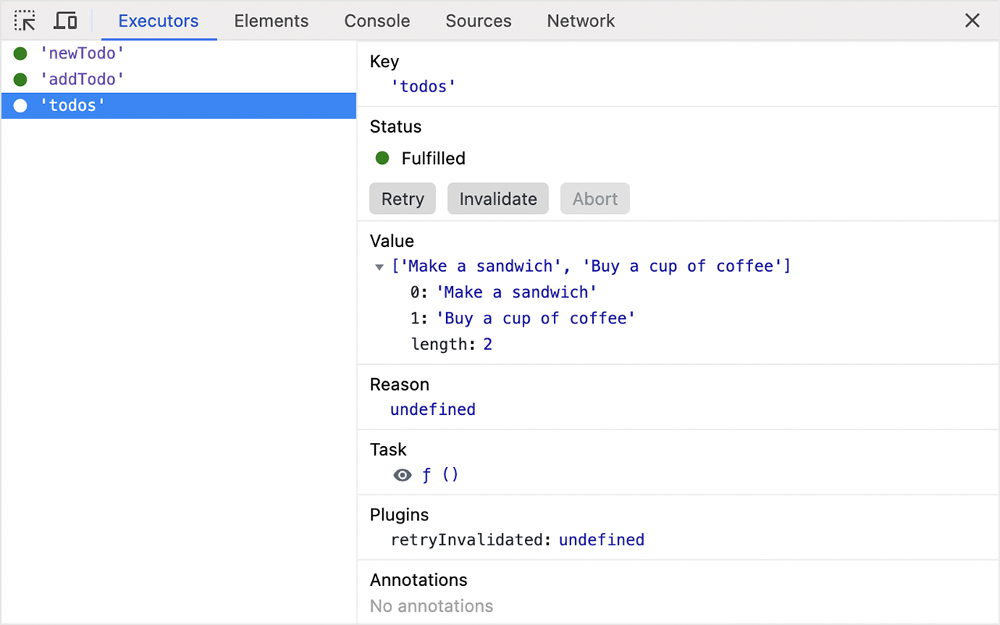

# react-executor-devtools

Devtools browser extension for [React Executor](https://github.com/smikhalevski/react-executor).

Install the extension from the Chrome Web Store and try it live with
[the example project](https://codesandbox.io/p/sandbox/react-executor-example-ltflgy?file=%2Fsrc%2FTodoListApp.tsx).

 

## Running this extension

1. Clone this repository.
2. Load this directory in Chrome as an [unpacked extension](https://developer.chrome.com/docs/extensions/mv3/getstarted/development-basics/#load-unpacked).
3. Navigate to a webpage and open the devtools window.
4. Navigate to the new devtools panel named "Executors".
